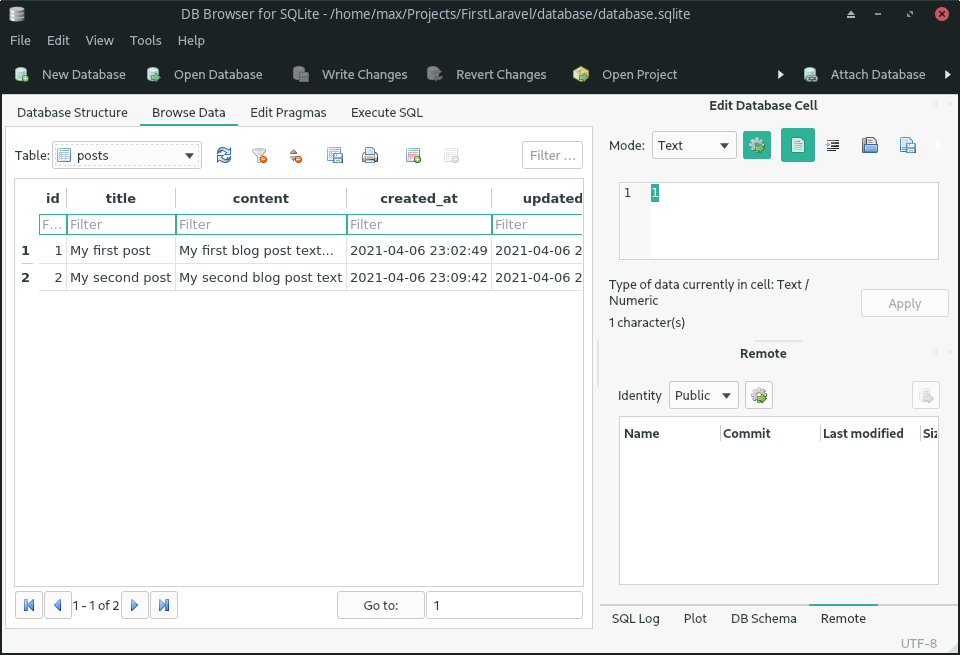

# First Laravel PHP

A simple example of how to create a RESTful API in Laravel Framework 8.36.1.

I used Database **sqlite** because I wanted to deploy this project very quickly and easy.
You can easily change the type of database and its connection in the **[config file](.env)**.

## Endpoints

**Get all posts:** `GET /api/posts`

**Get a single post:** `GET /api/posts/{id}`

**Create a new post:** `POST /api/posts`

**Update a post:** `PUT /api/posts/{id}`

**Delete a post:** `DELETE /api/posts/{id}`

## Routes

```
Route::get('/posts', [PostsApiController::class, 'index']);
Route::get('/post/{post}', [PostsApiController::class, 'get']);
Route::post('/posts', [PostsApiController::class, 'store']);
Route::put('/posts/{post}', [PostsApiController::class, 'update']);
Route::delete('/posts/{post}', [PostsApiController::class, 'destroy']);
```

### Laravel artisan commands

```
php artisan --version
rm database/database.sqlite 
sqlite3 database/database.sqlite "create table aTable(field1 int); drop table aTable;"
php artisan make:model Post -m
php artisan migrate
php artisan migrate:fresh
php artisan migrate:status
php artisan migrate:reset
php artisan migrate:refresh
php artisan migrate
php artisan make:controller PostsApiController 
```

### Insert fake/sample data to database

**$ php artisan tinker**

```
Psy Shell v0.10.7 (PHP 8.0.3 — cli) by Justin Hileman
>>> $post = new Post;
[!] Aliasing 'Post' to 'App\Models\Post' for this Tinker session.
=> App\Models\Post {#3329}
>>> $post->title = 'My first post'
=> "My first post"
>>> $post->content = 'My first blog post text...'
=> "My first blog post text..."
>>> $post->save()
=> true

>>> $post = new Post
=> App\Models\Post {#3322}
>>> $post->title = 'My second post'
=> "My second post"
>>> $post->content = 'My second blog post text'
=> "My second blog post text"
>>> $post->save()
=> true
```

### Database Preview




## Acknowledgment

<!-- https://www.youtube.com/watch?v=WDha52dbLWM -->
I saw an Youtube video and It's encouraged me to write a similar project myself.

© Copyright Max Base 2021
